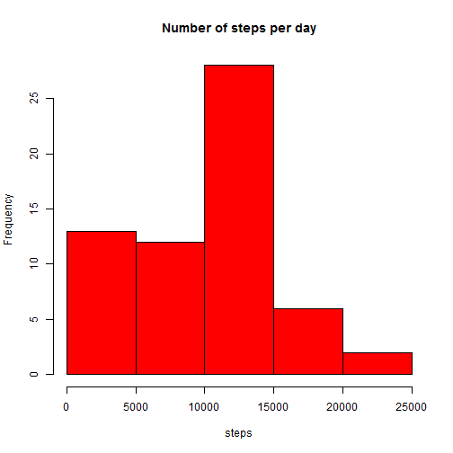
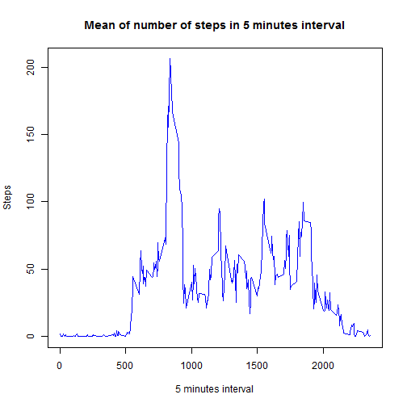
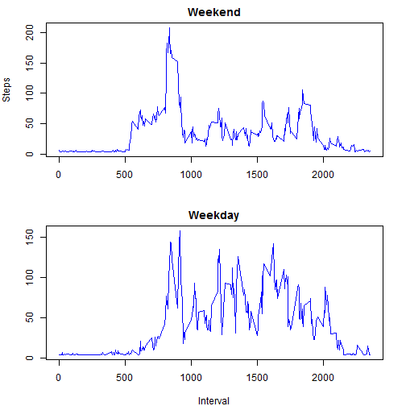

# Reproducible Research: Peer Assessment 1


## Loading and preprocessing the data
script to read de data set


```r
w <- read.csv("activity.csv", header = T, )
library(ggplot2)
library(lattice)
```


Explore and summarize the data


```r
str(w)
```

```
## 'data.frame':	17568 obs. of  3 variables:
##  $ steps   : int  NA NA NA NA NA NA NA NA NA NA ...
##  $ date    : Factor w/ 61 levels "2012-10-01","2012-10-02",..: 1 1 1 1 1 1 1 1 1 1 ...
##  $ interval: int  0 5 10 15 20 25 30 35 40 45 ...
```

```r
summary(w)
```

```
##      steps               date          interval   
##  Min.   :  0.0   2012-10-01:  288   Min.   :   0  
##  1st Qu.:  0.0   2012-10-02:  288   1st Qu.: 589  
##  Median :  0.0   2012-10-03:  288   Median :1178  
##  Mean   : 37.4   2012-10-04:  288   Mean   :1178  
##  3rd Qu.: 12.0   2012-10-05:  288   3rd Qu.:1766  
##  Max.   :806.0   2012-10-06:  288   Max.   :2355  
##  NA's   :2304    (Other)   :15840
```

```r
w$interval <- as.factor(w$interval)
w$date <- as.Date(w$date)
```


agregate the data in days 


```r
d <- tapply(w$steps, w$date, na.rm = T, sum)
```


plot the histogram 


```r
hist(d, main = "Number of steps per day", xlab = "steps", col = "red", breaks = 5)
```

 


## What is mean total number of steps taken per day?

The mean and the median are: 

```r
mean(d, na.rm = T)
```

```
## [1] 9354
```

```r
median(d, na.rm = T)
```

```
## [1] 10395
```


## What is the average daily activity pattern?

``
the average number of step in the 5 minutes interval is: 

```r
five <- tapply(w$steps, w$interval, na.rm = T, mean)
five <- as.data.frame(five)
five <- cbind(as.numeric(rownames(five)), five)
colnames(five) <- c("interval", "steps")
```

Graphically the number of stpeps in the 5 minutes intervals.


```r
plot(five$interval, five$steps, type = "l", main = "Mean of number of steps in 5 minutes interval", 
    ylab = "Steps", xlab = "5 minutes interval", col = "blue")
```

 

The five minutes interval with the maximun number of steps is

```r
five[five$steps == max(five$steps), 1]
```

```
## [1] 835
```


with the value of 


```r
round(max(five$steps), 1)
```

```
## [1] 206.2
```


## Imputing missing values
The total number of NA's is: 

```r
length(w[w$steps == "NA", 1])
```

```
## [1] 2304
```

The missing values are replaced with the mean value for 5 minutes interval.A new data frame were created.


```r
w2 <- w

for (i in 1:17568) {
    if (is.na(w2[i, 1])) {
        w2[i, 1] = mean(d, na.rm = T)/288
    }
}
```

The new values for mean and median are: 


```r
d2 <- tapply(w2$steps, w2$date, sum)
mean(d2)
```

```
## [1] 10581
```

```r
median(d2)
```

```
## [1] 10395
```

The mean values are different but the median are the same 


## Are there differences in activity patterns between weekdays and weekends?

In order to make the two sets of data: 

```r

w2$day <- weekdays(w2$date)

wk <- subset(w2, day == "sábado" | day == "domingo", select = c(interval, steps))

wkd <- subset(w2, day == "lunes" | day == "martes" | day == "miércoles" | day == 
    "jueves" | day == "viernes", select = c(interval, steps))
```


For weekdays:

```r
five1 <- tapply(wk$steps, wk$interval, mean)
five1 <- as.data.frame(five1)
five1 <- cbind(as.numeric(rownames(five1)), five1)
colnames(five1) <- c("interval", "steps")
```


for weekends:

```r
five2 <- tapply(wkd$steps, wkd$interval, mean)
five2 <- as.data.frame(five2)
five2 <- cbind(as.numeric(rownames(five2)), five2)
colnames(five2) <- c("interval", "steps")
```

Comparing the two sets of data


```r
par(mfrow = c(2, 1))
par(mar = c(4, 4, 2, 2))

plot(five2$interval, five2$steps, type = "l", main = "Weekend", xlab = "", ylab = "Steps", 
    col = "blue")

plot(five1$interval, five1$steps, type = "l", main = "Weekday", xlab = "Interval", 
    ylab = "", col = "blue")
```

 


